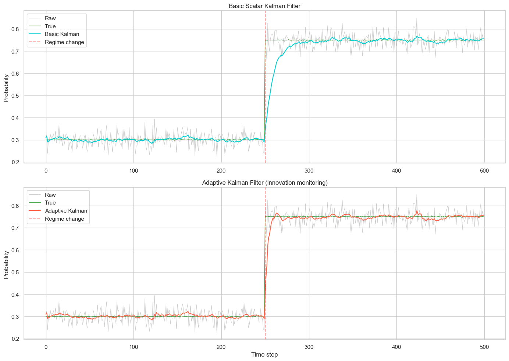
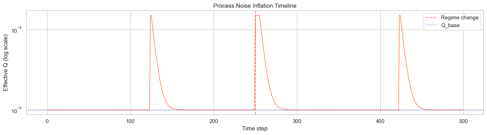
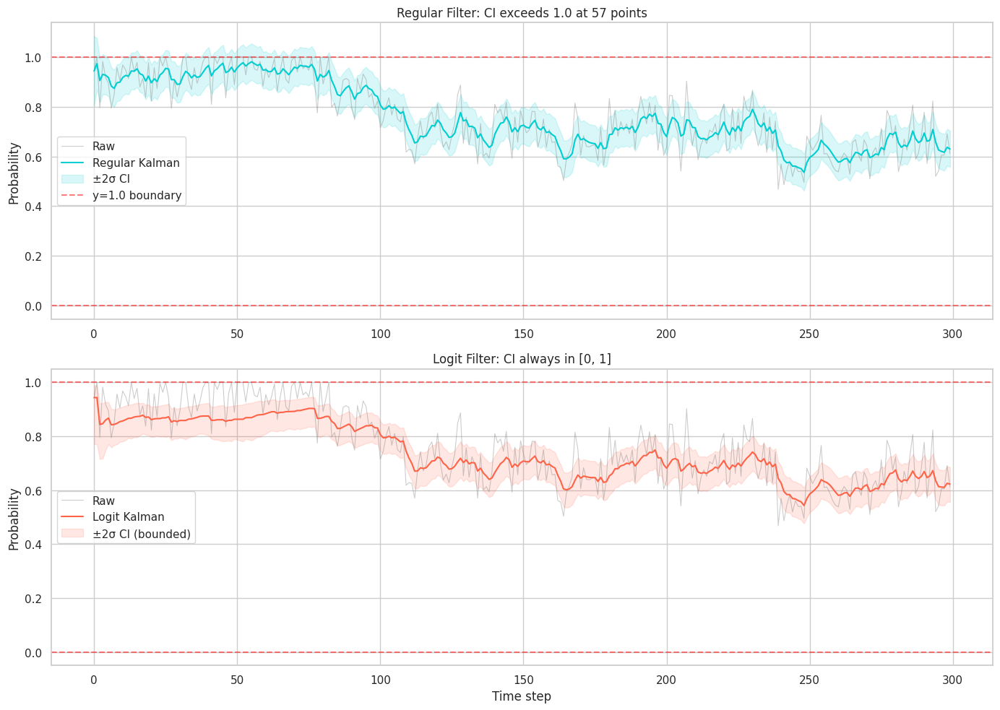
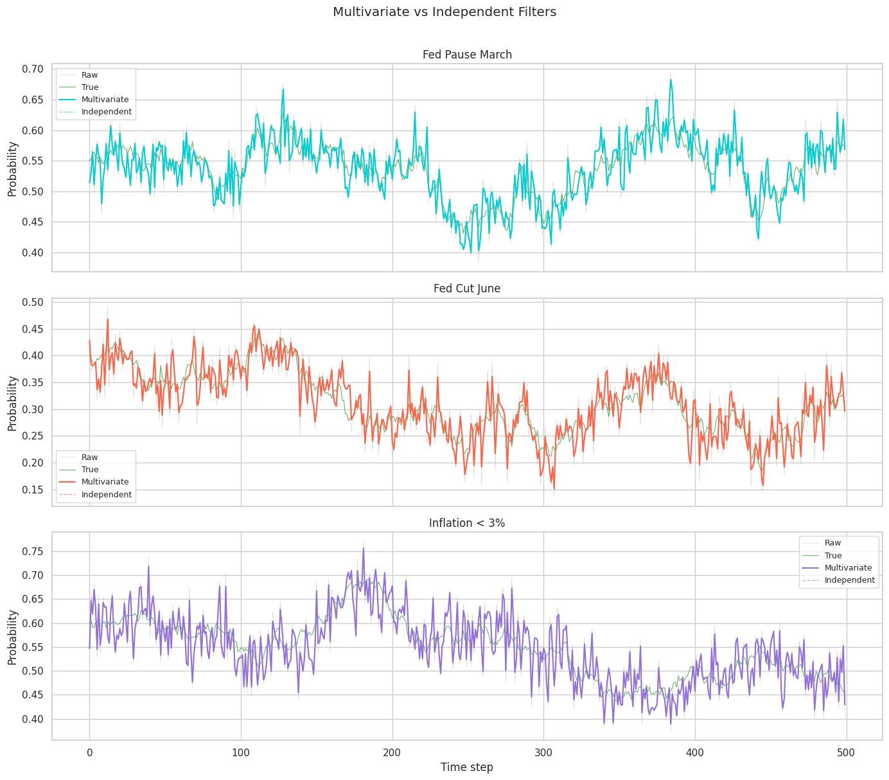

# Kalman Filtering for Prediction Markets

**Extracting true probabilities from noisy market prices in real time.**

[](https://www.python.org/downloads/)
[](LICENSE)

---

## The Problem

A prediction market contract trading at **$0.65** implies a 65% probability that some event will occur. But that price is *noisy* — distorted by wide bid-ask spreads, thin order books, behavioral biases, stale quotes, and panic trading. The **true** probability might be 0.62, or 0.68. You can't tell from a single price observation.

## The Solution

The [Kalman filter](https://en.wikipedia.org/wiki/Kalman_filter) is a recursive Bayesian estimator that separates signal from noise. At each time step, it maintains a **probability estimate** and a **confidence measure**, updating both as new prices arrive:

- When the market is **liquid and active** → the filter trusts new observations more
- When spreads are **wide and books are thin** → the filter trusts its own estimate more

This project implements four Kalman filter variants from scratch — no `filterpy`, no `pykalman` — building from the simplest scalar case through adaptive, logit-space, and multivariate filters.

## Results at a Glance

| Filter Variant | What It Does | Key Result |
|---|---|---|
| **Scalar Kalman** | Basic noise filtering | 3–10x noise reduction depending on Q/R ratio |
| **Adaptive Kalman** | Tracks regime changes via innovation monitoring | **65% faster** recovery after sudden probability shifts |
| **Logit Kalman** | Operates in log-odds space | Guarantees estimates stay in [0, 1] — no boundary violations |
| **Multivariate Kalman** | Tracks correlated market clusters | Propagates information across related markets, even with missing data |

<p align="center">
  
</p>
<p align="center"><em>The adaptive filter (bottom) recovers from a regime change in ~15 steps vs ~50+ for the basic filter.</em></p>

## Quick Start

```bash
# Clone and install
git clone https://github.com/NicolasLeyvaPA/kalman.git
cd kalman
pip install -e ".[dev]"

# Run the filter on synthetic data
python -c "
from src.data.synthetic import generate_random_walk
from src.filters.scalar_kalman import ScalarKalmanFilter

data = generate_random_walk(n_steps=500, Q=1e-4, R=1e-3, seed=42)
kf = ScalarKalmanFilter(Q=1e-4, R=1e-3)
result = kf.filter(data.observations)
print(f'True state:     {data.true_states[-1]:.4f}')
print(f'Raw price:      {data.observations[-1]:.4f}')
print(f'Filtered est:   {result.states[-1]:.4f} ± {result.covariances[-1]**0.5:.4f}')
print(f'Kalman gain:    {result.gains[-1]:.4f}')
"

# Run tests
pytest tests/ -v
```

## How It Works

### The Math (30-Second Version)

The true probability $x_t$ follows a random walk, and we observe a noisy version $z_t$:

```
State:       x_t = x_{t-1} + w_t,    w_t ~ N(0, Q)     # true probability drifts slowly
Observation: z_t = x_t + v_t,         v_t ~ N(0, R)     # market price = truth + noise
```

The Kalman filter recursively computes:

```
Predict:  x̂_prior = x̂_prev           (carry forward)
          P_prior = P_prev + Q        (uncertainty grows)

Update:   K = P_prior / (P_prior + R) (Kalman gain: balance prediction vs observation)
          x̂ = x̂_prior + K * (z - x̂_prior)   (update estimate)
          P = (1 - K) * P_prior       (uncertainty shrinks)
```

The **Kalman gain** K is the key: it automatically decides how much to trust the new observation vs the previous estimate, based on relative uncertainty.

### The Code

Each filter is a Python class with a clean `predict()` → `update()` interface:

```python
from src.filters.scalar_kalman import ScalarKalmanFilter

kf = ScalarKalmanFilter(Q=1e-4, R=1e-3)

# Process observations one at a time
for price in market_prices:
    state = kf.step(price)
    print(f"Estimate: {state.x:.4f}, Gain: {state.K:.4f}, Uncertainty: {state.P:.2e}")

# Or batch process
result = kf.filter(all_observations)
```

The adaptive filter adds regime detection:

```python
from src.filters.adaptive_kalman import AdaptiveKalmanFilter

akf = AdaptiveKalmanFilter(
    Q_base=1e-5, R=1e-3,
    threshold=2.5,     # normalized innovation threshold
    inflation=15.0,    # Q multiplier when regime detected
    decay=0.8,         # exponential decay back to baseline
)
result = akf.filter(observations)
```

## Filter Variants

### 1. Scalar Kalman Filter
The foundation. Tracks a single market's probability with fixed noise parameters Q (process) and R (observation). Includes **maximum likelihood estimation** to automatically find optimal Q and R from data.

### 2. Adaptive Kalman Filter
Monitors the **normalized innovation** (prediction error / expected error). When a surprise exceeds a threshold (default 2.5σ), it temporarily inflates Q by 15x, letting the filter "catch up" to the new regime. The inflation decays exponentially back to baseline.

<p align="center">
  
</p>
<p align="center"><em>Q spikes at the regime change (t≈250) and decays back to baseline.</em></p>

### 3. Logit-Space Filter
The standard Kalman filter can produce estimates outside [0, 1] — invalid for probabilities. The logit filter transforms to log-odds space where the domain is unbounded, runs the filter there, then transforms back via the sigmoid function. Confidence intervals become naturally asymmetric near boundaries.

<p align="center">
  
</p>
<p align="center"><em>Regular filter (top) violates probability bounds; logit filter (bottom) stays in [0, 1].</em></p>

### 4. Multivariate Filter
Tracks N correlated markets simultaneously. When "Fed Pause March" moves, the filter immediately updates its estimate for "Fed Cut June" using the cross-correlation structure — even before that market trades. Uses **Ledoit-Wolf shrinkage** for stable covariance estimation.

<p align="center">
  
</p>

## Notebooks

Interactive Jupyter notebooks walk through each filter variant with visualizations:

| Notebook | Topic | What You'll See |
|---|---|---|
| [`01_basic_filter`](notebooks/01_basic_filter.ipynb) | Scalar Kalman filter | Filtering, gain convergence, parameter sensitivity, MLE |
| [`02_adaptive_filter`](notebooks/02_adaptive_filter.ipynb) | Adaptive noise | Regime change tracking, Q inflation, dynamic R from microstructure |
| [`03_logit_filter`](notebooks/03_logit_filter.ipynb) | Logit-space filter | Bounded estimates, asymmetric confidence intervals |
| [`04_multivariate_filter`](notebooks/04_multivariate_filter.ipynb) | Correlated markets | Cross-market propagation, missing data handling |
| [`05_regime_and_realtime`](notebooks/05_regime_and_realtime.ipynb) | Regime detection + backtest | CUSUM, chi-square tests, Brier score comparison |

```bash
# Run the notebooks
jupyter notebook notebooks/
```

## Project Structure

```
kalman/
├── src/
│   ├── filters/           # All filter implementations
│   │   ├── scalar_kalman.py         # Basic Kalman filter
│   │   ├── adaptive_kalman.py       # Adaptive with innovation monitoring
│   │   ├── logit_kalman.py          # Logit-space bounded filter
│   │   ├── multivariate_kalman.py   # Multi-market correlated filter
│   │   ├── noise_estimation.py      # Dynamic R from microstructure
│   │   └── parameter_estimation.py  # MLE for Q and R
│   ├── data/              # Data generation and API clients
│   │   ├── synthetic.py             # Synthetic data with known ground truth
│   │   ├── models.py               # Data models (MarketObservation, etc.)
│   │   └── polymarket_client.py     # Polymarket API client
│   ├── detection/         # Regime change detection
│   │   └── regime_detector.py       # CUSUM, chi-square, autocorrelation
│   ├── analysis/          # Evaluation tools
│   │   ├── metrics.py               # Brier score, log loss, calibration
│   │   ├── correlation.py           # Ledoit-Wolf covariance shrinkage
│   │   └── visualization.py         # Plotting utilities
│   ├── pipeline/          # End-to-end pipelines
│   │   ├── backtest.py              # Backtesting framework
│   │   └── realtime_pipeline.py     # Real-time filtering pipeline
│   └── utils/             # Helpers
│       ├── math_helpers.py          # Numerical utilities
│       └── transforms.py           # Logit/sigmoid transforms
├── tests/                 # Test suite
├── notebooks/             # Interactive demonstrations
├── paper/                 # Academic paper (LaTeX)
│   ├── paper.pdf          # Compiled paper (21 pages)
│   ├── paper.tex          # LaTeX source
│   └── figures/           # All figures from notebook simulations
└── docs/                  # Additional documentation
```

## Paper

The full academic write-up is available at [`paper/paper.pdf`](paper/paper.pdf) (21 pages). It covers the mathematical framework, implementation details with code snippets, and all experimental results with figures directly from the notebook simulations.

## Testing

```bash
pytest tests/ -v                          # Full test suite
pytest tests/test_scalar_kalman.py -v     # Specific filter
pytest tests/ -k "adaptive" -v            # By keyword
```

## Key References

- Kalman, R.E. (1960). *A New Approach to Linear Filtering and Prediction Problems.* Journal of Basic Engineering.
- Schweppe, F.C. (1965). *Evaluation of Likelihood Functions for Gaussian Signals.* IEEE Trans. Info Theory.
- Mehra, R.K. (1972). *Approaches to Adaptive Filtering.* IEEE Trans. Automatic Control.
- Ledoit, O. & Wolf, M. (2004). *Honey, I Shrunk the Sample Covariance Matrix.* Journal of Portfolio Management.
- Hasbrouck, J. (2007). *Empirical Market Microstructure.* Oxford University Press.

## License

MIT
